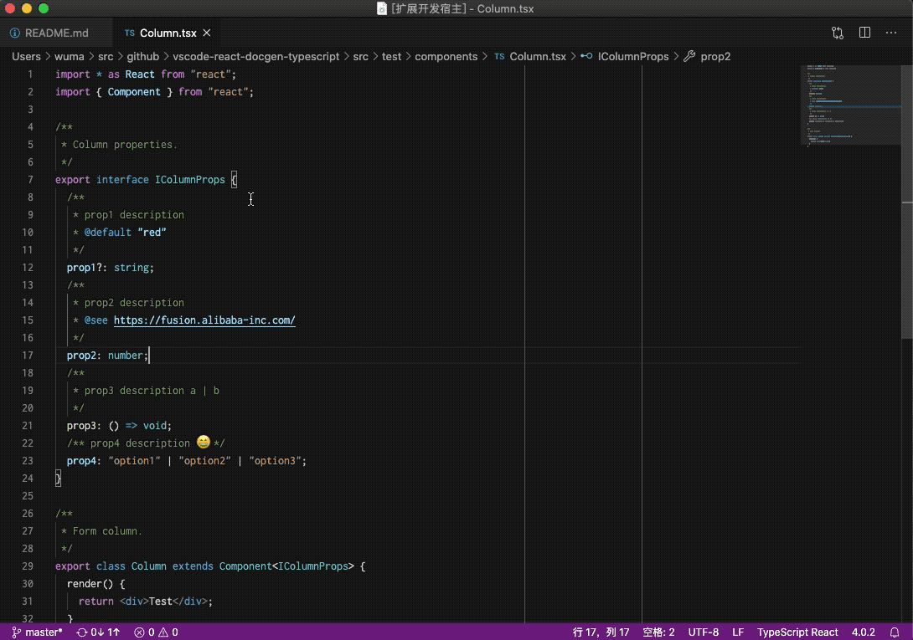
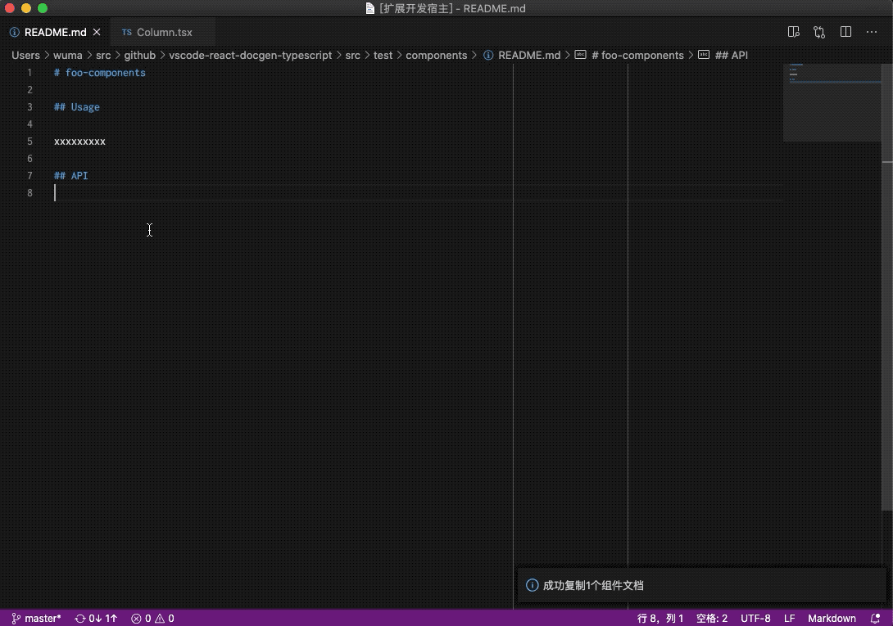

# vscode-react-docgen-typescript

## Features

Generate TS React component document to clipboard

Insert TS React component documentation in Markdown

## Release Notes

### 1.0.2

- feat: Insert TS React component documentation in Markdown

### 1.0.0

- feat: Generate TS React component document to clipboard

### For more information

* [react-docgen-typescript](https://github.com/styleguidist/react-docgen-typescript)

**Enjoy!**
